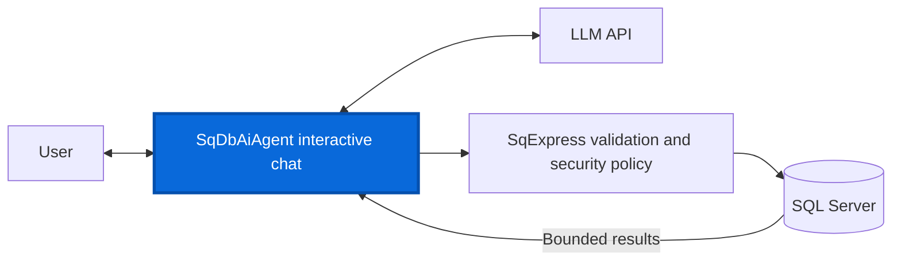
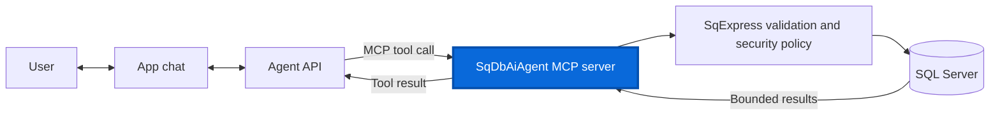

# SqDbAiAgent Demo

This repository demonstrates how an AI assistant can answer questions about a SQL Server database without giving generated SQL unrestricted access to it. Users ask questions in ordinary language; the application gives the agent a controlled description of the exposed schema and lets it propose read-only queries when data is needed.

The project is guided by four goals:

- **Protection against AI hallucinations.** Treat generated SQL as untrusted input and prevent mistaken or destructive statements, such as `DROP DATABASE`, from reaching the database execution path.
- **Object-level permissions.** Control which schemas, tables, and columns the agent may discover and query.
- **Row-level permissions.** Restrict which records a particular user may see, even within an otherwise permitted table.
- **Controlled update operations.** Support narrowly defined data changes for which the application - not the model - determines the available mutations, validates their inputs and scope, and applies any required authorization or confirmation.

The current demo applies the first three goals to read-only queries. Generated SQL is treated as an untrusted proposal. [SqExpress](https://github.com/0x1000000/SqExpress) parses it into an expression tree, checks it against the exposed tables and columns, rejects unsupported or unsafe operations, and adds a default row limit when the query has no explicit outer limit. The application can then apply a database-specific row-level security policy before executing the resulting query and returning a bounded, user-oriented answer. These safeguards are enforced in application code rather than delegated to prompt instructions. Narrow investigation queries use the same protected path when the agent needs to resolve a concrete uncertainty before producing its final response.

These protected database capabilities are available through the two integration modes shown below. In both modes, proposed SQL passes through the same SqExpress validation and security pipeline before it can reach SQL Server, and only bounded results are returned.

**Built-in interactive chat**

In this mode, SqDbAiAgent owns the user conversation and tool orchestration. It communicates with the configured LLM, validates the SQL proposed during that exchange, executes approved queries, and incorporates the results into the response shown to the user.



**MCP mode**

In this mode, the external app chat and its agent API own the conversation and orchestration. The agent calls the SqDbAiAgent MCP server over HTTP or standard input/output to inspect the exposed schema and submit queries. The MCP server provides the protected database tools and does not initialize an LLM of its own.



## Contents

- [Getting started](#getting-started)
- [Configuration](#configuration)
- [Design principles](#design-principles)
- [MCP server](#mcp-server)
- [HarborFlow demo database](#harborflow-demo-database)
- [HarborFlow schema layout](#harborflow-schema-layout)
- [HarborFlow entity overview](#harborflow-entity-overview)
- [Security model in the demo](#security-model-in-the-demo)
- [Example conversation](#example-conversation)
- [Files of interest](#files-of-interest)

## Getting started

Install the .NET 8 SDK and ensure that SQL Server is reachable. To work with the included [HarborFlow demo database](#harborflow-demo-database), create it first by running [db_create.sql](./db_create.sql) against SQL Server. Then copy [appsettings.Development.example.json](./SqDbAiAgent.Console/appsettings.Development.example.json) to `SqDbAiAgent.Console/appsettings.Development.json`.

Before starting the application, review these settings in the development file:

- **Every mode:** set `App:ConnectionString` to the target SQL Server database. This is the primary required setting because schema discovery and every query use this connection.
- **Interactive chat:** select `App:LlmProvider`. For the default local setup, configure `Ollama:BaseUrl` and `Ollama:Model` and ensure Ollama is running. When using OpenRouter instead, configure `OpenRouter:Model` and provide `OpenRouter:ApiKey` through a local setting or environment variable.
- **HTTP MCP:** replace `McpHttp:ApiKey` and change `McpHttp:Url` if the default `http://localhost:5080` listener is unsuitable.
- **Stdio MCP:** no LLM or HTTP configuration is used; only the database settings are required.

With no `--transport` argument, the application starts interactive chat using the configured provider and model. The HTTP and stdio transports start an MCP server instead and do not initialize an LLM.

1. Interactive chat

   ```powershell
   dotnet run --project SqDbAiAgent.Console\SqDbAiAgent.ConsoleApp.csproj
   ```

2. MCP over HTTP

   ```powershell
   dotnet run --project SqDbAiAgent.Console\SqDbAiAgent.ConsoleApp.csproj -- --transport http
   ```

3. MCP over stdio

   ```powershell
   dotnet run --project SqDbAiAgent.Console\SqDbAiAgent.ConsoleApp.csproj -- --transport stdio
   ```

## Configuration

The application is configured through [appsettings.json](./SqDbAiAgent.Console/appsettings.json).

For local development overrides, you can also use `SqDbAiAgent.Console/appsettings.Development.json`. This file is git-ignored so it is a safe place for machine-local settings such as API keys. The application loads it automatically after the base `appsettings.json`, so values in it override the shared defaults without requiring extra environment setup. A tracked starter file is available at [appsettings.Development.example.json](./SqDbAiAgent.Console/appsettings.Development.example.json).

The complete configuration, shown with comments, is:

```json
{
  "App": {
    // SQL Server connection used for schema discovery and query execution.
    "ConnectionString": "Server=(local);Database=HarborFlow;Integrated Security=True;TrustServerCertificate=True",

    // Interactive LLM provider: Ollama or OpenRouter. MCP mode does not use it.
    "LlmProvider": "Ollama",

    // Maximum agent-loop steps for one user request.
    "MaxAgentSteps": 5,

    // Maximum result cells rendered back into the agent's context.
    "MaxAgentVisibleCells": 1000,

    // Added through the SqExpress tree when no outer TOP or OFFSET/FETCH exists.
    // An explicit query limit, including a larger one, is preserved.
    "DefaultQueryRowLimit": 100,

    // Enables investigation in interactive chat; MCP always exposes the tool.
    "InvestigationEnabled": false,

    // Maximum investigation probes allowed for one interactive request.
    "MaxInvestigationQueries": 3,

    // Maximum investigation result cells returned to the agent as evidence.
    "MaxInvestigationVisibleCells": 100,

    // Approval/repair attempts before an invalid SQL proposal is abandoned.
    "MaxSqlFixAttempts": 10,

    // Additional repair attempts after SQL Server rejects approved SQL at runtime.
    "MaxSqlRuntimeFixAttempts": 3,

    // Attempts to obtain a valid structured agent action or message analysis.
    "MaxClassificationAttempts": 3,

    // In Auto mode, reasoning begins after this many failed attempts.
    "ThinkAfterAttempt": 3,

    // Auto, Enabled, or Disabled.
    "Reasoning": "Auto",

    // Auto, Enabled, or Disabled. Auto falls back to structured JSON actions
    // when the selected model does not support native tool calling.
    "ToolCalling": "Auto",

    // Minimal exposes submit_sql only. Full also exposes describe_database,
    // clarify_request, and finish_conversation.
    "ToolScope": "Full",

    // Attempts to obtain one valid SQL-repair response.
    "MaxFixResponseAttempts": 3,

    // Repeated unchanged SQL responses allowed before repair is stopped.
    "MaxUnchangedSqlResponses": 2,

    // Total character budget for prompt, request, history, and tool results.
    "MaxPromptChars": 32000,

    // Reserved space below the effective prompt limit.
    "PromptSafetyChars": 1500
  },

  "Logging": {
    "File": {
      // Empty or omitted disables file logging. Relative paths use the application directory.
      "Path": "",
      // PlainText (default) or Jsonl.
      "Format": "PlainText",
      // Warning is the default. Debug includes prompts, MCP arguments/results, SQL, and returned rows.
      "MinimumLevel": "Warning",
      // Daily JSONL files older than this are removed. Only files matching Path are considered.
      "RetainedDays": 7
    }
  },
  "McpHttp": {
    // Streamable HTTP listener; the MCP endpoint is /mcp.
    "Url": "http://localhost:5080",

    // Bearer token required by every HTTP MCP request. Replace this placeholder,
    // preferably through the McpHttp__ApiKey environment variable.
    "ApiKey": "CHANGE_ME"
  },

  "Ollama": {
    // Local Ollama endpoint and model used by interactive chat.
    "BaseUrl": "http://localhost:11434",
    "Model": "qwen3.5:4b",
    "TimeoutSeconds": 180
  },

  "OpenRouter": {
    // OpenAI-compatible OpenRouter endpoint and credentials.
    "BaseUrl": "https://openrouter.ai/api/v1",
    "ApiKey": "",
    "Model": "openai/gpt-5.4-nano",

    // Optional headers identifying the calling application.
    "Referer": "",
    "Title": "SqDbAiAgent",
    "TimeoutSeconds": 180
  }
}
```

### LLM provider choice

For debugging and local experimentation, it makes sense to use a local LLM through Ollama.

In practice, `qwen3.5:4b` is a reasonable starting point for this demo. It provides acceptable results on consumer hardware and was usable on an RTX 3070 during development, especially for simpler requests and validation flow testing.

For better query quality, especially on harder analytical requests, a premium cloud LLM is usually required. That is why this project also includes an OpenRouter client, so the same application can be pointed at a stronger hosted model when higher-quality results are needed.

In short:

- use `Ollama` for local debugging, development, and fast iteration
- use `OpenRouter` when you want access to stronger hosted models

## Design principles

SqDbAiAgent separates the agent's reasoning from the application's authority. The model may decide what information it needs and propose SQL, but it never receives a direct database connection and does not decide whether its own query is safe. The application owns schema exposure, validation, security enforcement, execution, and result bounds.

The same principles apply whether a request comes from the built-in chat or an external MCP client:

- **Schema-bounded access.** The agent receives the configured catalog name and only the exposed tables, columns, SQL types, and inferred relationships. Proposed SQL may reference only that schema.
- **Deterministic approval.** Final queries are parsed by SqExpress and checked for read-only behavior before execution. Unknown objects, metadata access, mutations, and unsupported syntax are rejected.
- **Bounded results.** Queries without an explicit outer `TOP` or `OFFSET ... FETCH` receive `App:DefaultQueryRowLimit` through the SqExpress expression tree. Explicit outer limits are preserved, while rendered results are independently bounded before entering agent context.
- **Security outside the prompt.** A configured security policy may rewrite an approved expression with visibility predicates. Selectable identities are offered only when the connected database has a corresponding security profile.
- **Focused investigation.** The agent may run a narrow probe to resolve a concrete uncertainty such as a stored code, date boundary, null pattern, possible EAV value, filter, or zero-row result. Investigation evidence informs the final response but is not presented as the answer itself.

Interactive chat exposes these capabilities through native tools when supported and through structured JSON actions otherwise. Its minimal tool scope contains `submit_sql`; full scope also includes `describe_database`, `clarify_request`, and `finish_conversation`. `investigate_sql` is available when `InvestigationEnabled` is enabled.

MCP exposes `get_database_schema`, `submit_sql`, and `investigate_sql`. It conditionally exposes `list_security_users` when a selectable-user security profile exists. The external MCP agent owns orchestration, so investigation is always available in MCP.

Final and investigation SQL share the same parser, exposed-schema allow-list, read-only enforcement, configured security policy, SqExpress rewriting, and SQL Server execution path. A row-returning investigation must use a bounded `TOP` and either `DISTINCT` or a selective `WHERE`; alternatively, it may return one aggregate value. Broad scans, `SELECT *`, metadata queries, grouped aggregates, and multiple result sets are rejected. Interactive chat also rejects duplicate probes and probes beyond `MaxInvestigationQueries`.

The schema guidance notes that Entity/Attribute/Value is a common relational pattern, but the application does not automatically detect, sample, or assume an EAV mapping.

## MCP server

Both MCP transports expose the `database://schema` resource and the tools described in [Design principles](#design-principles). During initialization, the server sends its database workflow as automatic MCP instructions and also exposes the same guidance through the `database_agent` prompt.

The configured catalog name from `App:ConnectionString` appears in the instructions and schema payload so the external agent can identify the connected database. Prompt templates and MCP descriptions contain no hard-coded demo-domain name. MCP performs no LLM-based SQL repair; deterministic validation and SQL Server errors are returned to the client.

### HTTP transport

Configure a non-placeholder API key:

```json
{
  "McpHttp": {
    "Url": "http://localhost:5080",
    "ApiKey": "replace-with-a-long-random-secret"
  }
}
```

Start the server with:

```text
SqDbAiAgent.ConsoleApp.exe --transport http
```

Prefer the `McpHttp__ApiKey` environment variable for the secret. The stateless streamable HTTP endpoint is `/mcp`, and every request requires `Authorization: Bearer <key>` using fixed-time key comparison. MCP modes write no operational console output; configure file logging for diagnostics.

When a selectable-user security profile is available, the HTTP client supplies the selected identity through `X-Database-User-Id`. When no such profile exists, the security-user tool and its related instructions are not exposed.

Plain HTTP does not protect the bearer token in transit. Use the default loopback listener for local access or place the server behind properly configured HTTPS.

### Stdio transport

Start a local MCP stdio server with:

```text
SqDbAiAgent.ConsoleApp.exe --transport stdio
```

Use `--database-user-id 7` to bind the process to a selectable security identity when the connected database has a corresponding security profile. Omitting the argument or using `0` selects the trusted, unfiltered local view. A positive ID is validated during startup and cannot be changed through tools.

Stdout is reserved exclusively for MCP protocol traffic. Application and framework console output is disabled; fatal startup diagnostics use stderr. HTTP URL, API-key, and console-output settings do not apply to stdio.

`--transport` accepts only `http` and `stdio`. The documented form uses separate option and value arguments. For compatibility with launchers that produce one combined argument, `--transport=stdio` and `"--transport stdio"` are also accepted.

Configure the MCP client to launch the Release executable as a local stdio server. For clients that use a TOML server table, the equivalent entry is:

```toml
[mcp_servers.sq-db-ai]
enabled = true
command = '<repository-path>\SqDbAiAgent.Console\bin\Release\net8.0\SqDbAiAgent.ConsoleApp.exe'
args = ["--transport", "stdio"]
```

Restart the MCP client after rebuilding the executable or changing its configuration. Confirm that `sq-db-ai` is connected through the client's MCP status view, then ask naturally, for example: `Use sq-db-ai to summarize the available data.`

## HarborFlow demo database

This repository also contains a demo SQL Server database, `HarborFlow`, which illustrates how database-specific security policy can be applied.

HarborFlow is a small operational sales and fulfillment domain. It models:

- branches
- employees
- customers
- product categories and products
- warehouses and inventory balances
- sales orders and sales order lines
- shipments and shipment lines
- invoices and payments
- application users and security access mappings

## HarborFlow schema layout

The demo schema is intentionally split into three areas:

- `ref`
  Reference and master data that is safe to expose to the AI agent for query generation. This schema contains business entities such as branches, employees, customers, products, warehouses, and inventory balances.
- `ops`
  Operational transaction data that the AI agent can read. This schema contains sales orders, order lines, shipments, shipment lines, invoices, and payments.
- `sec`
  Security and permission data that is not intended for normal AI prompt exposure. This schema contains application users and access-mapping tables used by the security filter.

## HarborFlow entity overview

The main relationships in the demo database are:

- a branch owns employees, customers, and warehouses
- a customer belongs to a branch and may prefer a warehouse
- a product belongs to a product category
- inventory balance tracks stock per warehouse and product
- a sales order belongs to a branch, customer, and sales representative
- a sales order has one or more sales order lines
- each sales order line points to a product and warehouse
- a shipment belongs to a sales order and warehouse
- a shipment has shipment lines linked to sales order lines
- an invoice belongs to a sales order
- a payment belongs to an invoice
- an application user may be linked to an employee and may have branch/customer visibility through security tables

## Security model in the demo

The demo uses HarborFlow-specific security rules to show how SqExpress expressions can be modified before execution.

At a high level:

- the agent works only with the public part of the schema
- the app validates the generated query against the allowed table model
- the HarborFlow security filter inspects the query expression
- for every visited query specification, it adds row-level `EXISTS` predicates when the selected user is restricted
- the final secured expression is exported to SQL and executed

This keeps the security policy in application code instead of in the prompt, and allows the same general agent flow to be reused for different databases with different security filters.

## Example conversation

Below is a shortened example of how the demo application can interact with a user. This example was captured with full access selected at startup by entering `0` as the user id.

```text
Application:
Enter user id or /exit: 0
No user was selected. The app will show all available data.
```

```text
User:
What can you do?
```

```text
Assistant:
I can help you write and run read-only SQL queries against the HarborFlow database.
For example:
1) List recently created sales orders (by OrderDate)
2) Find the top customers by total invoiced amount this year
3) Show sales by product category for a date range
4) Report invoice totals and payment totals by invoice status
5) Rank sales reps by number of orders or total sales in a period
6) Show shipment counts and quantities by carrier and shipment date
```

```text
User:
Show me all active branches
```

```text
Application result:
```

| BranchId | BranchCode | BranchName | Region | City | IsActive | CreatedUtc |
|---|---|---|---|---|---|---|
| 3 | CAL | Calgary Branch | Alberta | Calgary | True | 29.03.2026 20:56:39 |
| 2 | OTT | Ottawa Branch | Ontario | Ottawa | True | 29.03.2026 20:56:39 |
| 1 | TOR | Toronto Branch | Ontario | Toronto | True | 29.03.2026 20:56:39 |

```text
Application:
Rows: 3
```

```text
Assistant:
Active branches found: Calgary Branch (Alberta, Calgary), Ottawa Branch (Ontario, Ottawa), and Toronto Branch (Ontario, Toronto). Want results limited to a specific region or city?
```

```text
User:
How many people work in the branches?
```

```text
Application result:
```

| TotalEmployees |
|---|
| 13 |

```text
Application:
Rows: 1
```

```text
Assistant:
There are 13 employees working in branches (employees with a non-null BranchId).
```

```text
User:
Show 5 recent sales orders
```

```text
Application result:
```

| SalesOrderId | OrderNumber | OrderDate | OrderStatus | CurrencyCode | Notes |
|---|---|---|---|---|---|
| 40 | SO-2026-0040 | 12.03.2026 0:00:00 | Approved | CAD | Lab headset refresh |
| 39 | SO-2026-0039 | 11.03.2026 0:00:00 | Submitted | CAD | Archive workstation add-on |
| 38 | SO-2026-0038 | 10.03.2026 0:00:00 | Draft | CAD | Router spare pool |
| 37 | SO-2026-0037 | 09.03.2026 0:00:00 | Closed | CAD | Follow-up branch order |
| 36 | SO-2026-0036 | 08.03.2026 0:00:00 | Closed | CAD | Late quarter accessories |

```text
Application:
Rows: 5
```

```text
Assistant:
Recent 5 sales orders (newest first): SO-2026-0040 (Approved, CAD, 2026-03-12), SO-2026-0039 (Submitted, CAD, 2026-03-11), SO-2026-0038 (Draft, CAD, 2026-03-10), SO-2026-0037 (Closed, CAD, 2026-03-09), SO-2026-0036 (Closed, CAD, 2026-03-08). Which date/status range should I pull next?
```

## Files of interest

- [db_create.sql](./db_create.sql)  
  Creates and seeds the HarborFlow demo database.
- [Program.cs](./SqDbAiAgent.Console/Program.cs)  
  Application startup and provider wiring.
- [DbChatSession.cs](./SqDbAiAgent.Console/Services/Chat/DbChatSession.cs)
  Main agent loop.
- [ValidatedSqlExecutor.cs](./SqDbAiAgent.Console/Services/Sql/ValidatedSqlExecutor.cs)
  Shared SQL approval, security rewriting, execution, runtime repair, and rendering boundary.
- [SqlApprovalSession.cs](./SqDbAiAgent.Console/Services/Sql/SqlApprovalSession.cs)
  SQL approval and repair loop.
- [MessageAnalyzeSession.cs](./SqDbAiAgent.Console/Services/Chat/MessageAnalyzeSession.cs)
  LLM-based message classification and topic detection.
- [HarborFlowSecurityFilter.cs](./SqDbAiAgent.Console/SecurityFilters/HarborFlow/HarborFlowSecurityFilter.cs)  
  HarborFlow-specific row-security logic.
- [McpServerHost.cs](./SqDbAiAgent.Console/Services/Mcp/McpServerHost.cs)
  Shared HTTP and stdio MCP hosting, authentication, transport selection, and conditional tool registration.
- [McpAgentInstructionsProviderService.cs](./SqDbAiAgent.Console/Services/Mcp/McpAgentInstructionsProviderService.cs)
  Shared automatic MCP instructions and named `database_agent` prompt content.
